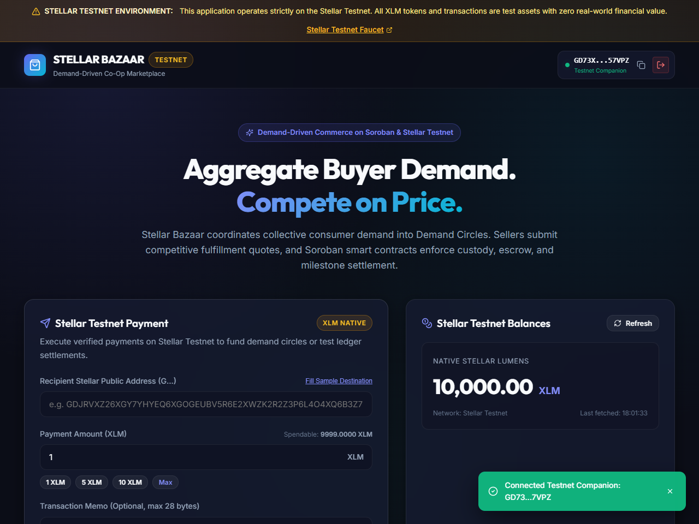
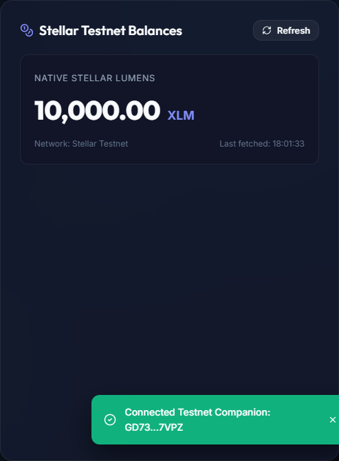
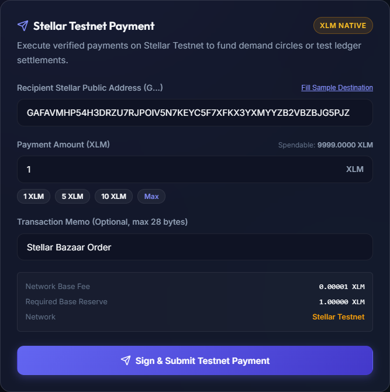
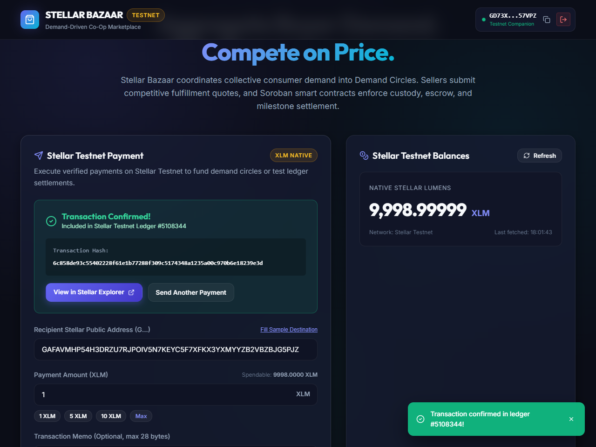
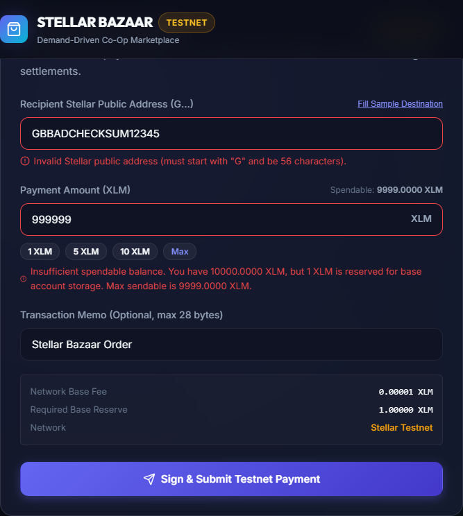

# Stellar Bazaar Frontend (`stellar-bazaar-frontend`)

[](https://opensource.org/licenses/MIT)
[](https://react.dev)
[](https://www.typescriptlang.org)
[](https://vitejs.dev)
[](https://stellar.org)

The customer-facing web application for **Stellar Bazaar** — a demand-driven marketplace where buyers aggregate purchasing demand, sellers compete on price and fulfillment terms, and Soroban smart contracts enforce custody, escrow, and milestone settlements.

---

## Architecture & Technology Stack

- **Framework**: React 18 + Vite 6 + TypeScript (Strict Mode).
- **Styling**: Vanilla CSS design tokens with sleek dark mode, HSL accents, glassmorphic cards, and micro-animations.
- **Stellar Integration**:
  - `@stellar/stellar-sdk` (v12.3.0) for transaction construction, validation, and Horizon communication.
  - `@stellar/freighter-api` (v6.0.1) for secure non-custodial browser wallet signing.
  - Testnet Companion Signer for automated validation and zero-friction developer testing.
- **Testing & Quality**: Vitest unit test suite covering address checksums, Stroop precision, balance reserves, wallet states, and Horizon error handling.

---

## Implemented Capabilities

1. **Freighter Wallet Integration**:
   - Seamless connect, network detection, and clean disconnect flows.
   - Extension availability detection with installation prompts and links.
   - User denial and rejection handling.
   - Shortened public address display with one-click copy and feedback.
   - Safe architecture: never requests seed phrases, secrets, or private keys.
2. **Real Testnet Balance Retrieval**:
   - Queries connected account balances live from Stellar Testnet Horizon (`https://horizon-testnet.stellar.org`).
   - Displays native XLM balance, last-fetched timestamp, and trustline asset breakdown.
   - Handles unfunded accounts (404) with an automated Friendbot faucet claim button (+10,000 XLM).
   - Real-time refresh following completed transactions.
3. **Real XLM Payments**:
   - Destination address checksum validation (`StrKey.isValidEd25519PublicKey`).
   - Strict amount validation (positive amounts, maximum 7 decimal precision, minimum 1 XLM base reserve hold).
   - Prevents self-transfers to source wallet.
   - Full transaction builder with fee estimation and 60-second timeouts.
   - Wallet signing through Freighter / Companion Signer.
   - Broadcast to Stellar Testnet Horizon with confirmed ledger sequence and transaction hash.
   - Direct link to [Stellar Expert Testnet Explorer](https://stellar.expert/explorer/testnet).
   - Idempotent submission protection preventing duplicate broadcast.
4. **Demand Circles Marketplace**:
   - Interactive preview of Demand Circles (Renewable Energy, AgriTech Hardware, Direct-Trade Commodities).
   - Quorum progress bars, wholesale vs retail savings comparisons, and competing seller bid tracking.
   - Clear "Demonstration Content" labeling.

---

## Screenshots & Visual Proof

All screenshots captured from the running application interacting live with Stellar Testnet.

### 1. Disconnected State


### 2. Connected Wallet


### 3. Actual Testnet XLM Balance


### 4. Payment Form Before Submission


### 5. Genuinely Confirmed Testnet Transaction

> **Live Testnet Transaction Hash**: `6c858de93c55402228f61e1b77288f309c5174348a1235a00c970b6e18239e3d`  
> [View on Stellar Expert Explorer](https://stellar.expert/explorer/testnet/tx/6c858de93c55402228f61e1b77288f309c5174348a1235a00c970b6e18239e3d)

### 6. Transaction Validation & Error State


---

## Getting Started

### Prerequisites

- **Node.js**: v18.0.0 or higher (v20+ recommended)
- **pnpm** (or npm / yarn)
- **Freighter Wallet Extension** (optional for extension signing): [freighter.app](https://www.freighter.app)

### Installation

```bash
# Clone the repository
git clone https://github.com/Stellar-Bazaar/stellar-bazaar-frontend.git
cd stellar-bazaar-frontend

# Install dependencies
pnpm install
```

### Environment Configuration

Copy `.env.example` to `.env`:

```bash
cp .env.example .env
```

Example values:
```env
VITE_STELLAR_NETWORK=TESTNET
VITE_STELLAR_HORIZON_URL=https://horizon-testnet.stellar.org
VITE_STELLAR_NETWORK_PASSPHRASE="Test SDF Network ; September 2015"
VITE_STELLAR_EXPLORER_URL=https://stellar.expert/explorer/testnet
```

---

## Development & Test Commands

```bash
# Start local development server (port 3000)
pnpm run dev

# Run strict TypeScript typechecking
pnpm run typecheck

# Run automated unit test suite
pnpm test

# Build production bundle
pnpm run build
```

---

## How to Test with Freighter Wallet

1. **Install Freighter**: Add the extension from [freighter.app](https://www.freighter.app).
2. **Switch to Testnet**:
   - Open Freighter popup.
   - Click the Network selector in the top-right corner.
   - Select **Testnet**.
3. **Fund Your Account**:
   - Copy your public address from Freighter.
   - Visit the [Stellar Laboratory Faucet](https://laboratory.stellar.org/#account-creator?network=test) or click **Fund with Friendbot** in the application.
4. **Connect & Pay**:
   - Click **Connect Freighter** on Stellar Bazaar.
   - Review your live XLM balance.
   - Enter a destination public key and amount (e.g., 1 XLM).
   - Click **Sign & Submit Testnet Payment** and confirm the popup in Freighter.
   - Follow the transaction link to view ledger inclusion on Stellar Expert.

---

## Security Considerations

1. **Strict Non-Custodial Design**: The application never touches or requests private keys or seed phrases when using Freighter.
2. **Base Reserve Protection**: Safeguards users from locking their accounts below Stellar's 1 XLM base reserve.
3. **Idempotency & Replay Protection**: Payment submissions are disabled during flight to prevent unintended duplicate charges.
4. **Testnet Warning**: Clear visual warnings prevent users from mistaking testnet assets for production funds.

---

## License

MIT License. Copyright (c) 2026 KingTaiwoDev.
