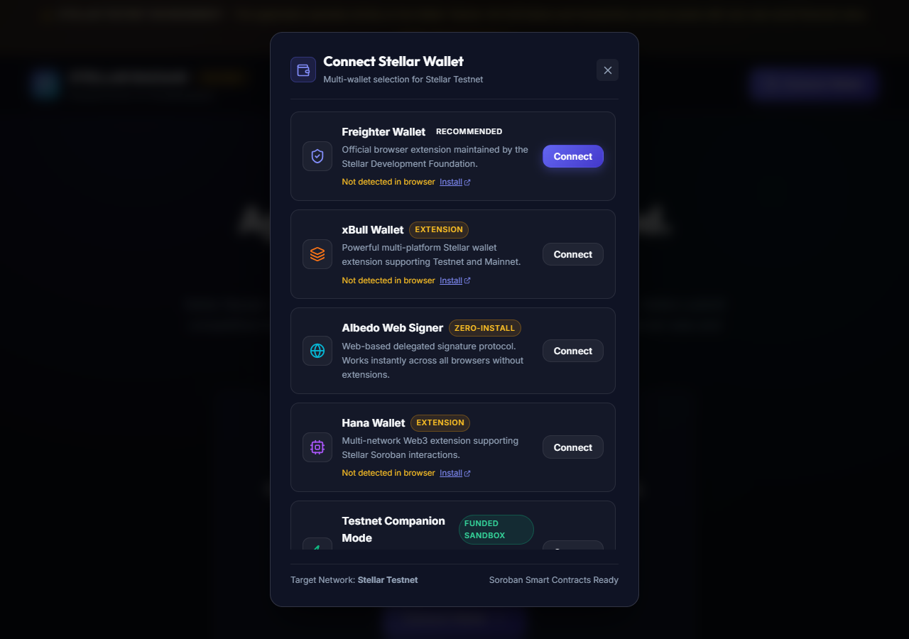
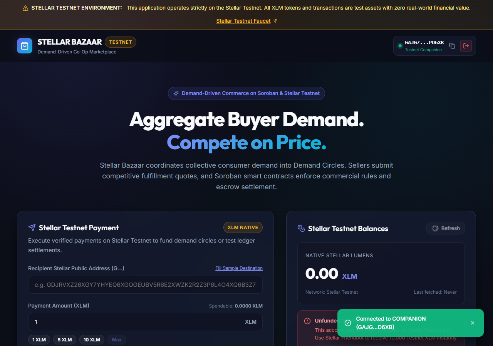
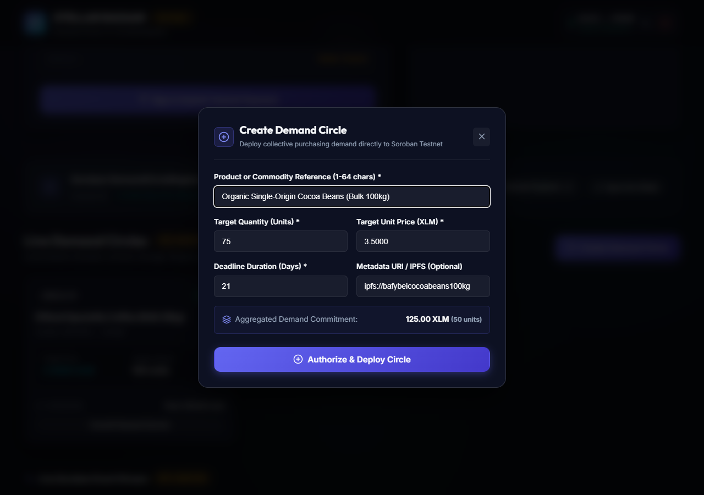
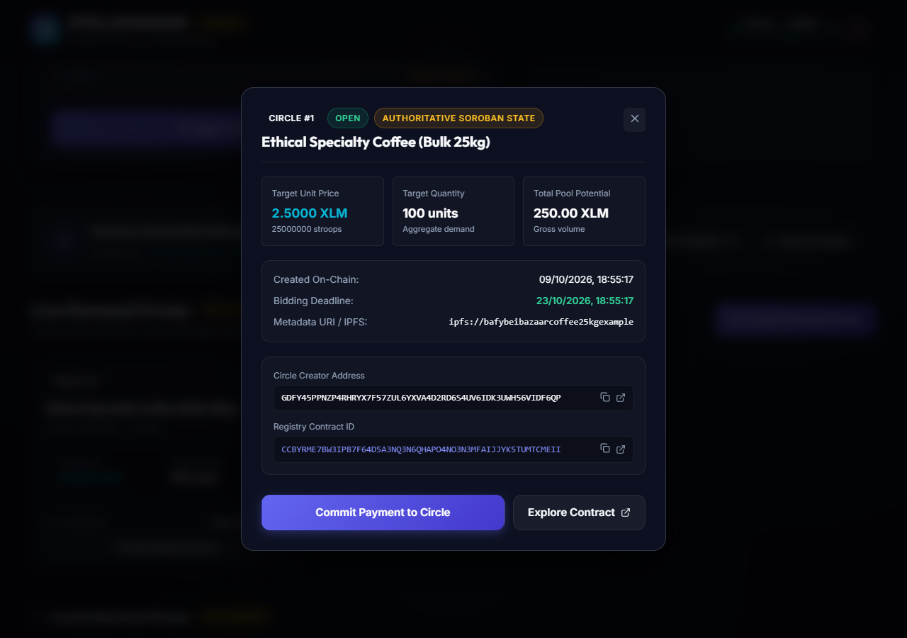
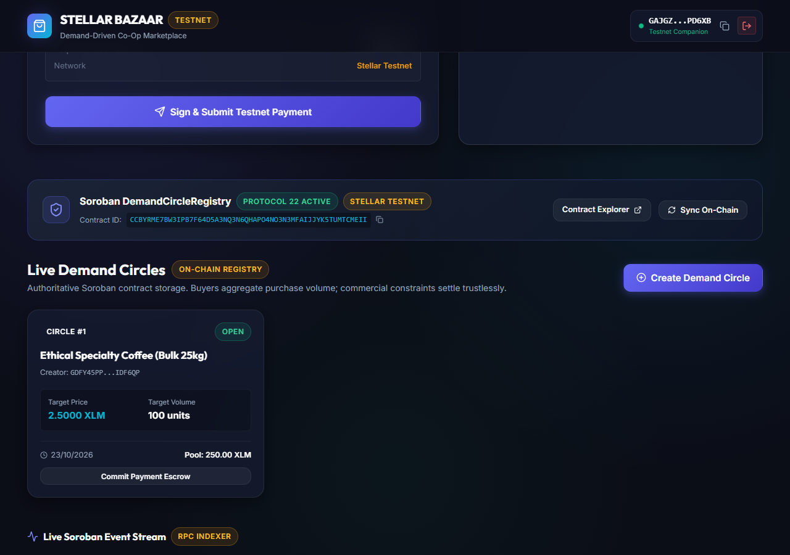

# Stellar Bazaar Frontend (`stellar-bazaar-frontend`)

[](https://opensource.org/licenses/MIT)
[](https://react.dev)
[](https://www.typescriptlang.org)
[](https://vitejs.dev)
[](https://stellar.org)
[](https://soroban.stellar.org)

The customer-facing decentralized web application for **Stellar Bazaar** — a demand-driven marketplace where buyers aggregate purchasing demand, sellers compete on unit price, and Soroban smart contracts enforce custody, commercial rules, and milestone escrow settlements.

---

## Architecture & Technology Stack

- **Framework**: React 18 + Vite 6 + TypeScript (Strict Mode).
- **Styling**: Vanilla CSS design system with HSL tokens, sleek dark mode, glassmorphism, responsive cards, and micro-animations.
- **Stellar & Soroban Integration**:
  - `@stellar/stellar-sdk` (v17.2.1) for Protocol 22 Soroban RPC simulation, preparation, and submission.
  - Multi-Wallet Provider: Unified manager supporting Freighter, xBull, Albedo, Hana, and Testnet Companion.
  - `@stellar/freighter-api` (v6.0.1) for secure browser wallet signing.
- **On-Chain Contract Interactions**:
  - Contract Name: `DemandCircleRegistry`
  - Deployed Contract ID: [`CCBYRME7BW3IPB7F64D5A3NQ3N6QHAPO4NO3N3MFAIJJYK5TUMTCMEII`](https://stellar.expert/explorer/testnet/contract/CCBYRME7BW3IPB7F64D5A3NQ3N6QHAPO4NO3N3MFAIJJYK5TUMTCMEII)
  - Network: Stellar Testnet (RPC: `https://soroban-testnet.stellar.org`)
- **Testing & Quality Assurance**: Vitest unit test suite covering address checksums, Stroop precision, wallet adapters, contract simulation boundaries, and idempotent event processing (28 passing tests).

---

## Implemented Capabilities

### 1. Multi-Wallet Support
- **Freighter Wallet**: Official Stellar browser extension with automatic detection, installation prompt, and non-custodial signing.
- **xBull Wallet**: Official multi-platform Stellar wallet extension with availability checks.
- **Albedo Web Signer**: Zero-install web intent signature protocol operating across all modern browsers.
- **Hana Wallet**: Multi-chain extension support for Stellar Soroban interactions.
- **Testnet Companion Mode**: Automated in-memory developer keypair funded with 10,000 Testnet XLM via Friendbot for seamless testing.
- **Wallet State Management**: Connect/disconnect, network verification, account switching, and error handling for user rejections or missing extensions.

### 2. Live Soroban Smart Contract Calling
- **Demand Circle Creation Form**:
  - Real-time input validation matching Soroban contract constraints (title length 1–64, target quantity > 0, price > 0, deadline 1–365 days).
  - Pre-execution transaction simulation using `rpc.Server.simulateTransaction`.
  - Transaction preparation with fee and resource footprint estimation.
  - Non-custodial signing through connected wallet.
  - Broadcast and confirmation on Stellar Testnet ledger.
  - Instant roundtrip update adding newly confirmed circles to UI.
- **Demand Circle Detail Modal**:
  - Direct read from authoritative on-chain storage via `get_circle(id)`.
  - Displays creator address, target quantity, price in XLM & stroops, total pool potential, creation date, bidding deadline, and expiry status.
  - One-click copy for creator and contract addresses.
  - Direct links to Stellar Expert Explorer.

### 3. Contract Event Stream & Synchronization
- Real-time polling and consumption of Soroban events via `rpc.Server.getEvents`.
- Idempotent deduplication protecting against replay and duplicate event delivery.
- Live event feed displaying circle creation, ledger sequence, timestamp, and transaction links.
- Clear distinction between live authoritative contract state and indexed cache.

### 4. Real Testnet Payments & Balance Foundation
- Connected account balance retrieval directly from Horizon (`https://horizon-testnet.stellar.org`).
- Integrated Friendbot claim button (+10,000 XLM).
- Real XLM payment flow with memo support and verified ledger confirmation.

---

## Genuine Application Screenshots

All screenshots were captured directly from the live application running against Stellar Testnet and the deployed Soroban contract.

### 1. Available Wallet Options
Shows the multi-wallet selection modal featuring Freighter, xBull, Albedo, Hana, and Testnet Companion.


### 2. Connected Wallet & Live Testnet Balance
Connected account display with public address, Testnet badge, and real XLM balances.


### 3. Create Demand Circle Form
Creation modal with validated commercial constraints, deadline selector, and aggregated demand calculations.


### 4. Retrieved On-Chain Circle State
Authoritative state retrieved directly from Soroban contract storage (`get_circle(1)`).


### 5. Verified Contract Call Transaction & Explorer Link
Detailed view with clickable Stellar Explorer links and copyable contract identifiers.


### 6. Visible Loading & Error Feedback
Form validation and error handling preventing invalid inputs.


### 7. Deployed Contract Address & Network Indicator
Marketplace header showing the deployed contract address, Protocol 22 status, and Testnet network indicator.


---

## Verified On-Chain Deployment Details

| Property | Value |
| :--- | :--- |
| **Contract Name** | `DemandCircleRegistry` |
| **Network** | Stellar Testnet (`Test SDF Network ; September 2015`) |
| **RPC Endpoint** | `https://soroban-testnet.stellar.org` |
| **Deployed Contract ID** | [`CCBYRME7BW3IPB7F64D5A3NQ3N6QHAPO4NO3N3MFAIJJYK5TUMTCMEII`](https://stellar.expert/explorer/testnet/contract/CCBYRME7BW3IPB7F64D5A3NQ3N6QHAPO4NO3N3MFAIJJYK5TUMTCMEII) |
| **WASM Hash** | `94eaa4d8f3b07aa50fd4362f64b3d614b27fc91ba4e69f143a02f7d5e5d8c3d4` |
| **Deployer Address** | `GDFY45PPNZP4RHRYX7F57ZUL6YXVA4D2RD6S4UV6IDK3UWH56VIDF6QP` |
| **Deployment Tx** | [`1c3a2dc05721f4f94c44ca693415130bd294c9dd7783578459b0de6c3fda2eba`](https://stellar.expert/explorer/testnet/tx/1c3a2dc05721f4f94c44ca693415130bd294c9dd7783578459b0de6c3fda2eba) |
| **Initialize Tx** | [`e8e36cbbb61761a232662791350307d345f627d627f62e47e0446e253e81f584`](https://stellar.expert/explorer/testnet/tx/e8e36cbbb61761a232662791350307d345f627d627f62e47e0446e253e81f584) |
| **Sample Circle #1 Tx** | [`e45b72348680d67113019b544744b2cd85cf32a874b15dc71506067f87e094c8`](https://stellar.expert/explorer/testnet/tx/e45b72348680d67113019b544744b2cd85cf32a874b15dc71506067f87e094c8) |

---

## Getting Started

### Prerequisites

- **Node.js**: v18.0.0 or higher
- **pnpm** (or npm / yarn)
- **Supported Wallet**: Freighter, xBull, Albedo, Hana, or Companion Mode

### Installation & Development

```bash
# Clone repository
git clone https://github.com/Stellar-Bazaar/stellar-bazaar-frontend.git
cd stellar-bazaar-frontend

# Install dependencies
pnpm install

# Run development server
pnpm run dev --port 3000

# Run Vitest unit tests
pnpm test

# Check TypeScript types
pnpm run typecheck

# Production build
pnpm run build
```

---

## License

MIT © 2026 KingTaiwoDev
