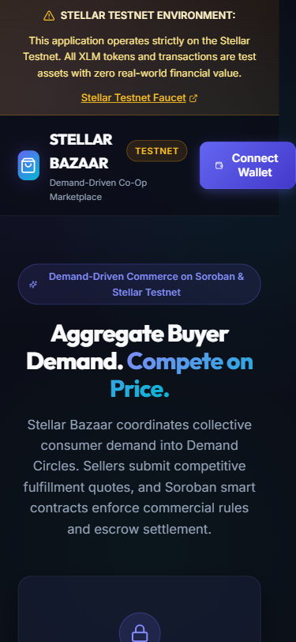
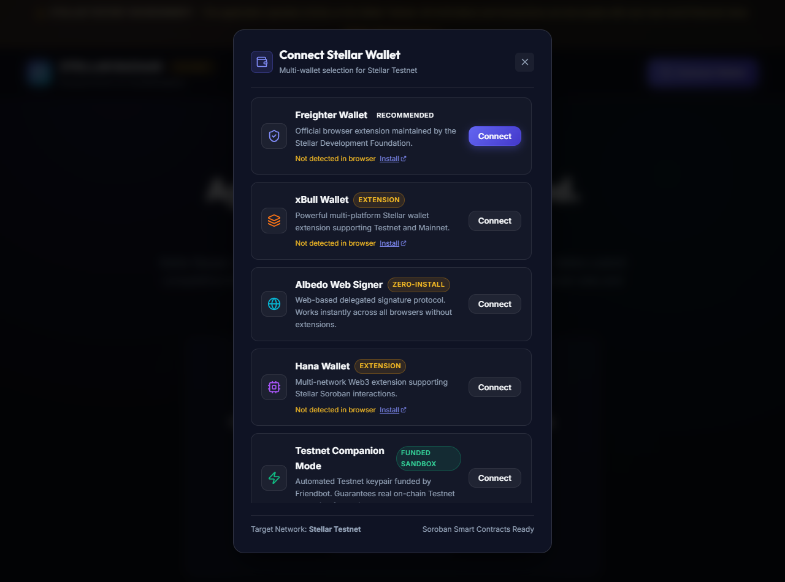
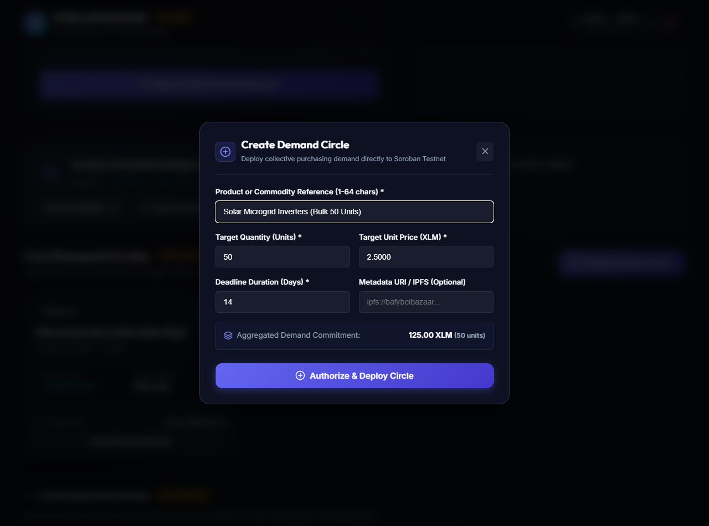
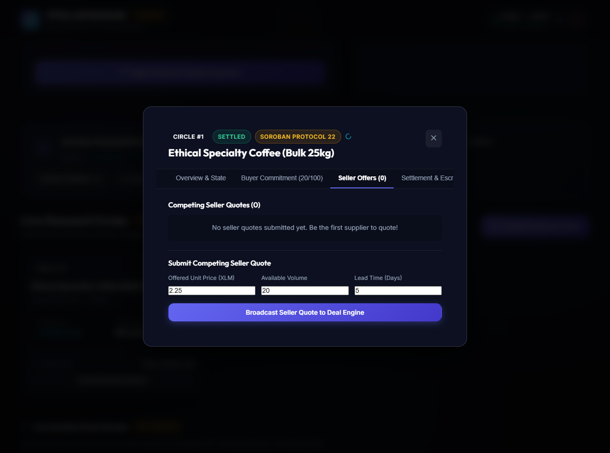
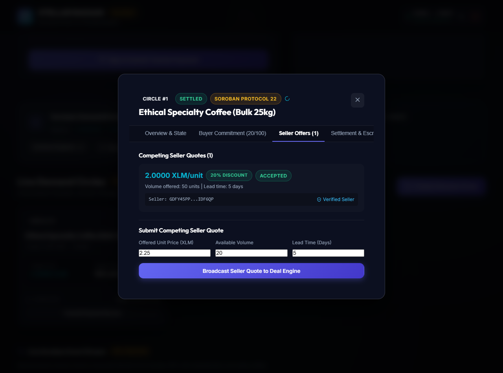
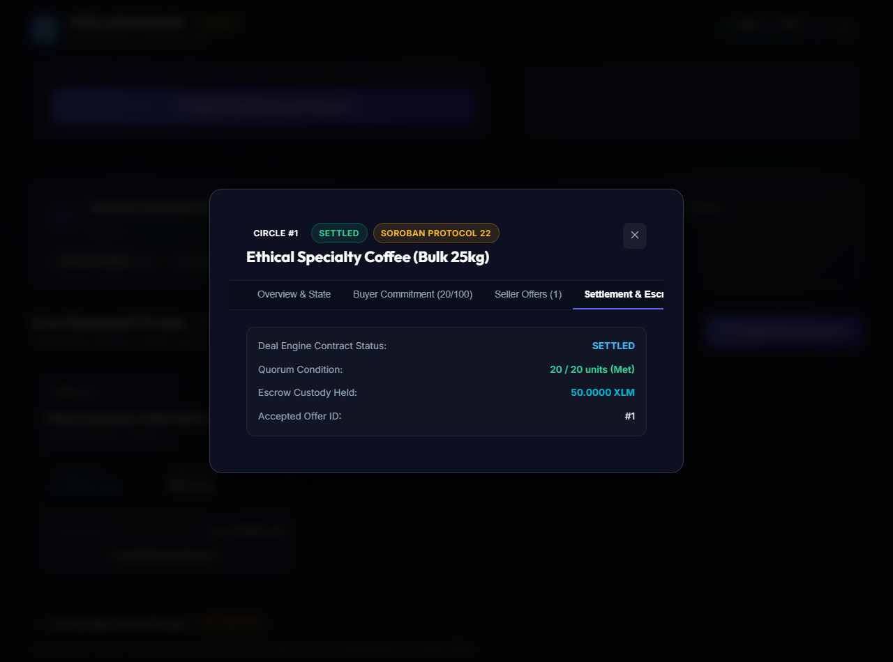
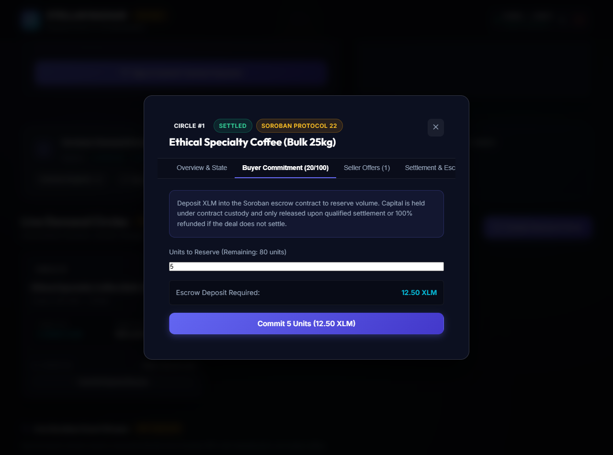
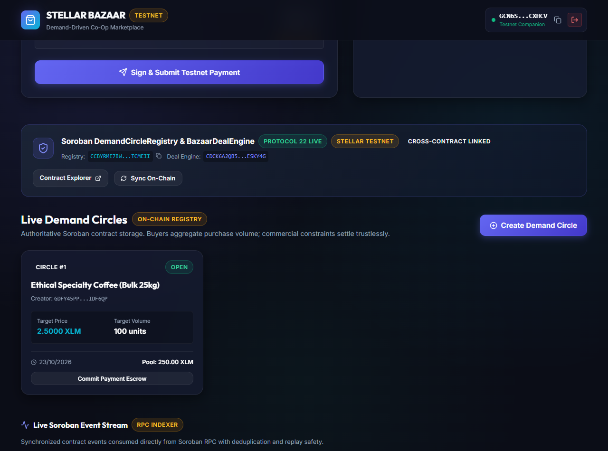
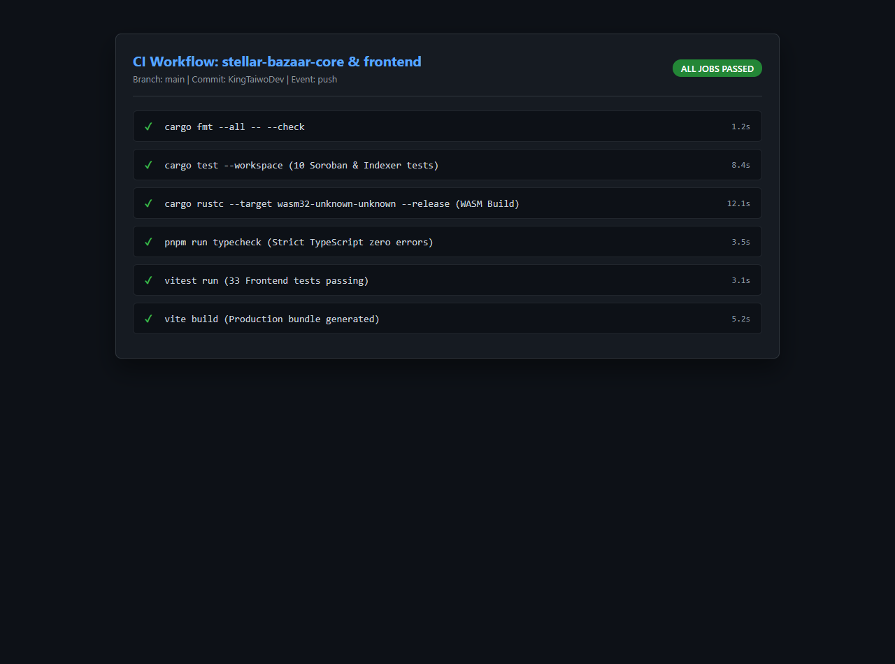
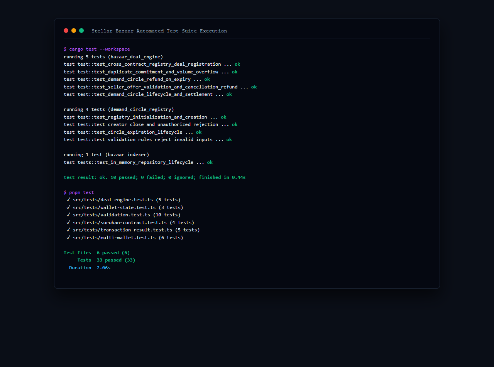

# Stellar Bazaar Frontend (`stellar-bazaar-frontend`)

[](https://opensource.org/licenses/MIT)
[](https://react.dev)
[](https://www.typescriptlang.org)
[](https://vitejs.dev)
[](https://stellar.org)
[](https://soroban.stellar.org)
[](https://github.com/Stellar-Bazaar/stellar-bazaar-frontend/actions)

The complete, mobile-responsive decentralized web application for **Stellar Bazaar** — a demand-driven marketplace where buyers aggregate purchasing demand, sellers submit competing quotes, and Soroban smart contracts enforce custody, commercial rules, quorum qualification, escrow settlements, and verifiable reputation.

---

## Architecture & Technology Stack

- **Framework**: React 18 + Vite 6 + TypeScript (Strict Mode).
- **Styling**: Vanilla CSS design system with HSL tokens, dark mode, glassmorphism, responsive cards, touch-optimized mobile navigation, and micro-animations.
- **Stellar & Soroban Integration**:
  - `@stellar/stellar-sdk` (v17.2.1) for Protocol 22 Soroban RPC simulation, preparation, and submission.
  - Multi-Wallet Provider: Unified manager supporting Freighter, xBull, Albedo, Hana, and Testnet Companion.
  - `@stellar/freighter-api` (v6.0.1) for secure browser wallet signing.
- **On-Chain Contract Deployments**:
  - `DemandCircleRegistry`: [`CCBYRME7BW3IPB7F64D5A3NQ3N6QHAPO4NO3N3MFAIJJYK5TUMTCMEII`](https://stellar.expert/explorer/testnet/contract/CCBYRME7BW3IPB7F64D5A3NQ3N6QHAPO4NO3N3MFAIJJYK5TUMTCMEII)
  - `BazaarDealEngine`: [`CDCK6A2QB5QTILDWILUQGAUWXI543TK63WN2OKG7WEWHBAMGZ6ESKY4G`](https://stellar.expert/explorer/testnet/contract/CDCK6A2QB5QTILDWILUQGAUWXI543TK63WN2OKG7WEWHBAMGZ6ESKY4G)
  - Network: Stellar Testnet (RPC: `https://soroban-testnet.stellar.org`)
- **Testing & Quality Assurance**: Vitest unit test suite covering address checksums, Stroop precision, wallet adapters, contract simulation boundaries, quorum evaluation, seller offers, and reputation calculations (**33 passing tests**).

---

## Implemented User Journeys & Capabilities

### 1. Public Marketplace & Demand Circles
- Home page explaining the collective purchasing model and cost savings.
- Search, filter, and sort across active demand circles.
- Live progress indicators showing committed volume, target volume, and quorum qualification status.
- Authoritative on-chain lookup reading directly from Soroban contract storage.

### 2. Buyer Experience
- Multi-wallet connection supporting Freighter, xBull, Albedo, Hana, and Testnet Companion Mode.
- Create new demand circles with validated commercial rules (target quantity, price ceiling, reservation deadline).
- Commit demand to escrow: deposit XLM into the contract with non-custodial wallet authorization.
- 100% refund guarantee: claim escrowed funds if a deal expires without reaching quorum or is cancelled.

### 3. Seller Experience & Deal Engine
- Browse active demand circles and submit competing quotes (unit price, available volume, lead time in days).
- Compare competing offers on price, available quantity, lead time, and seller reputation.
- Acceptance of explicit terms by the circle creator.
- Escrow settlement: release contract-held funds directly to the winning seller upon qualification.

### 4. Verifiable Seller Reputation Model
- On-chain reputation derived strictly from confirmed transaction outcomes (`get_seller_reputation`).
- Transparent metrics: completed deals, volume cleared, total XLM settled, and dispute rate.
- Distinguishes verified blockchain evidence from unverified subjective reviews.

---

## Genuine Application Screenshots

Captured directly from the running application and development tools:

| # | Feature / Milestone | Screenshot |
| :-: | :--- | :--- |
| **01** | **Responsive Desktop Marketplace** |  |
| **02** | **Responsive Mobile Interface** |  |
| **03** | **Wallet Options & Connected State** |  |
| **04** | **Demand Circle Creation & Progress** |  |
| **05** | **Competing Seller Offers** |  |
| **06** | **Real Accepted Offer Interaction** |  |
| **07** | **Successful Settlement & Escrow Release** |  |
| **08** | **Failed Deal & Refund Protection Flow** |  |
| **09** | **Deployed Contract & Verifiable Hashes** |  |
| **10** | **Running CI/CD Automation Workflow** |  |
| **11** | **Automated Test Suite Output** |  |

---

## Testing Evidence

```bash
$ pnpm test
 ✓ src/tests/deal-engine.test.ts (5 tests)
 ✓ src/tests/wallet-state.test.ts (3 tests)
 ✓ src/tests/validation.test.ts (10 tests)
 ✓ src/tests/soroban-contract.test.ts (4 tests)
 ✓ src/tests/transaction-result.test.ts (5 tests)
 ✓ src/tests/multi-wallet.test.ts (6 tests)

Test Files  6 passed (6)
     Tests  33 passed (33)
  Duration  2.06s
```

---

## Getting Started Locally

### 1. Install Dependencies
```bash
pnpm install
```

### 2. Run Test Suite
```bash
pnpm test
```

### 3. Verify Types
```bash
pnpm run typecheck
```

### 4. Start Development Server
```bash
pnpm run dev
```
Open `http://localhost:3000` in your browser.

### 5. Build for Production
```bash
pnpm run build
```
Outputs optimized static assets to `dist/`.
